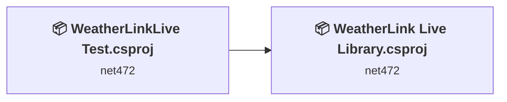
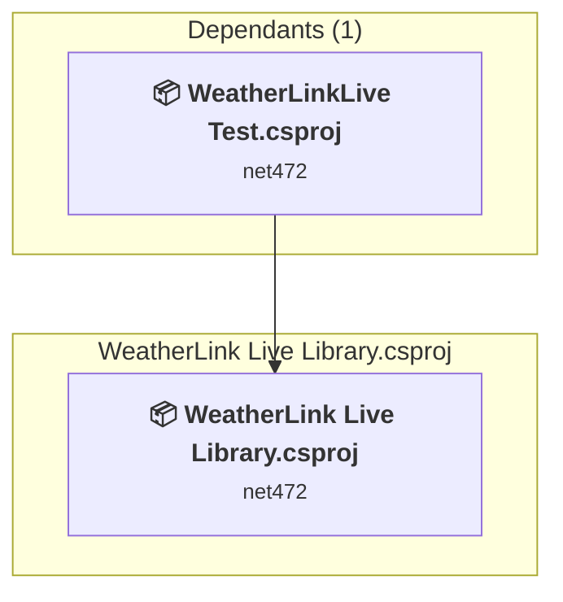
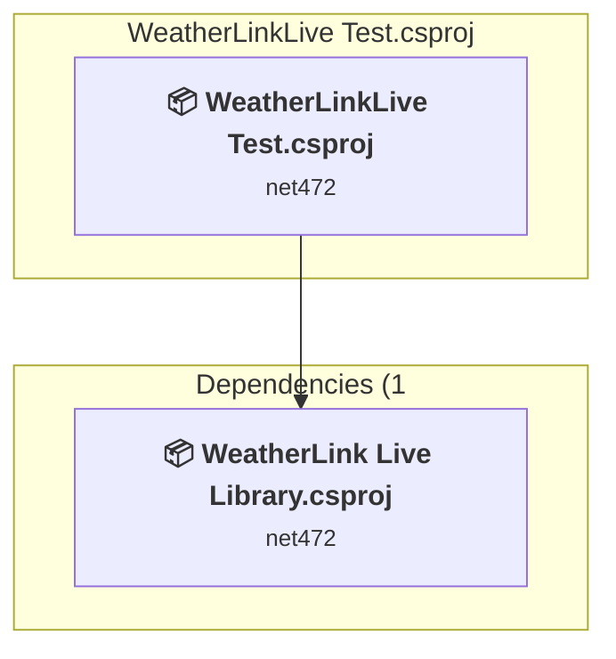

# Projects and dependencies analysis

This document provides a comprehensive overview of the projects and their dependencies in the context of upgrading to .NETCoreApp,Version=v10.0.

## Table of Contents

- [Executive Summary](#executive-Summary)
  - [Highlevel Metrics](#highlevel-metrics)
  - [Projects Compatibility](#projects-compatibility)
  - [Package Compatibility](#package-compatibility)
  - [API Compatibility](#api-compatibility)
- [Aggregate NuGet packages details](#aggregate-nuget-packages-details)
- [Top API Migration Challenges](#top-api-migration-challenges)
  - [Technologies and Features](#technologies-and-features)
  - [Most Frequent API Issues](#most-frequent-api-issues)
- [Projects Relationship Graph](#projects-relationship-graph)
- [Project Details](#project-details)

  - [WeatherLink Live Library\WeatherLink Live Library.csproj](#weatherlink-live-libraryweatherlink-live-librarycsproj)
  - [WeattherLinkLive Test\WeatherLinkLive Test.csproj](#weattherlinklive-testweatherlinklive-testcsproj)

## Executive Summary

### Highlevel Metrics

| Metric | Count | Status |
| :--- | :---: | :--- |
| Total Projects | 2 | All require upgrade |
| Total NuGet Packages | 5 | 1 need upgrade |
| Total Code Files | 5 |  |
| Total Code Files with Incidents | 2 |  |
| Total Lines of Code | 621 |  |
| Total Number of Issues | 5 |  |
| Estimated LOC to modify | 0+ | at least 0.0% of codebase |

### Projects Compatibility

| Project | Target Framework | Difficulty | Package Issues | API Issues | Est. LOC Impact | Description |
| :--- | :---: | :---: | :---: | :---: | :---: | :--- |
| [WeatherLink Live Library\WeatherLink Live Library.csproj](#weatherlink-live-libraryweatherlink-live-librarycsproj) | net472 | 🟢 Low | 2 | 0 |  | ClassLibrary, Sdk Style = True |
| [WeattherLinkLive Test\WeatherLinkLive Test.csproj](#weattherlinklive-testweatherlinklive-testcsproj) | net472 | 🟢 Low | 1 | 0 |  | DotNetCoreApp, Sdk Style = True |

### Package Compatibility

| Status | Count | Percentage |
| :--- | :---: | :---: |
| ✅ Compatible | 4 | 80.0% |
| ⚠️ Incompatible | 0 | 0.0% |
| 🔄 Upgrade Recommended | 1 | 20.0% |
| ***Total NuGet Packages*** | ***5*** | ***100%*** |

### API Compatibility

| Category | Count | Impact |
| :--- | :---: | :--- |
| 🔴 Binary Incompatible | 0 | High - Require code changes |
| 🟡 Source Incompatible | 0 | Medium - Needs re-compilation and potential conflicting API error fixing |
| 🔵 Behavioral change | 0 | Low - Behavioral changes that may require testing at runtime |
| ✅ Compatible | 60 |  |
| ***Total APIs Analyzed*** | ***60*** |  |

## Aggregate NuGet packages details

| Package | Current Version | Suggested Version | Projects | Description |
| :--- | :---: | :---: | :--- | :--- |
| Hafner.Compatibility.MetaPackage | 1.9.0 |  | [WeatherLink Live Library.csproj](#weatherlink-live-libraryweatherlink-live-librarycsproj) | ✅Compatible |
| IsExternalInit | 1.0.3 |  | [WeatherLink Live Library.csproj](#weatherlink-live-libraryweatherlink-live-librarycsproj) [WeatherLinkLive Test.csproj](#weattherlinklive-testweatherlinklive-testcsproj) | ✅Compatible |
| log4net | 3.3.1 |  | [WeatherLink Live Library.csproj](#weatherlink-live-libraryweatherlink-live-librarycsproj) [WeatherLinkLive Test.csproj](#weattherlinklive-testweatherlinklive-testcsproj) | ✅Compatible |
| Newtonsoft.Json | 13.0.5-beta1 | 13.0.4 | [WeatherLink Live Library.csproj](#weatherlink-live-libraryweatherlink-live-librarycsproj) | NuGet package upgrade is recommended |
| System.Net.Http | 4.3.4 |  | [WeatherLink Live Library.csproj](#weatherlink-live-libraryweatherlink-live-librarycsproj) [WeatherLinkLive Test.csproj](#weattherlinklive-testweatherlinklive-testcsproj) | NuGet package functionality is included with framework reference |

## Top API Migration Challenges

### Technologies and Features

| Technology | Issues | Percentage | Migration Path |
| :--- | :---: | :---: | :--- |

### Most Frequent API Issues

| API | Count | Percentage | Category |
| :--- | :---: | :---: | :--- |

## Projects Relationship Graph

Legend:
📦 SDK-style project
⚙️ Classic project

## Project Details

### WeatherLink Live Library\WeatherLink Live Library.csproj

#### Project Info

- **Current Target Framework:** net472
- **Proposed Target Framework:** net10.0
- **SDK-style**: True
- **Project Kind:** ClassLibrary
- **Dependencies**: 0
- **Dependants**: 1
- **Number of Files**: 2
- **Number of Files with Incidents**: 1
- **Lines of Code**: 493
- **Estimated LOC to modify**: 0+ (at least 0.0% of the project)

#### Dependency Graph

Legend:
📦 SDK-style project
⚙️ Classic project

### API Compatibility

| Category | Count | Impact |
| :--- | :---: | :--- |
| 🔴 Binary Incompatible | 0 | High - Require code changes |
| 🟡 Source Incompatible | 0 | Medium - Needs re-compilation and potential conflicting API error fixing |
| 🔵 Behavioral change | 0 | Low - Behavioral changes that may require testing at runtime |
| ✅ Compatible | 6 |  |
| ***Total APIs Analyzed*** | ***6*** |  |

### WeattherLinkLive Test\WeatherLinkLive Test.csproj

#### Project Info

- **Current Target Framework:** net472
- **Proposed Target Framework:** net10.0
- **SDK-style**: True
- **Project Kind:** DotNetCoreApp
- **Dependencies**: 1
- **Dependants**: 0
- **Number of Files**: 3
- **Number of Files with Incidents**: 1
- **Lines of Code**: 128
- **Estimated LOC to modify**: 0+ (at least 0.0% of the project)

#### Dependency Graph

Legend:
📦 SDK-style project
⚙️ Classic project

### API Compatibility

| Category | Count | Impact |
| :--- | :---: | :--- |
| 🔴 Binary Incompatible | 0 | High - Require code changes |
| 🟡 Source Incompatible | 0 | Medium - Needs re-compilation and potential conflicting API error fixing |
| 🔵 Behavioral change | 0 | Low - Behavioral changes that may require testing at runtime |
| ✅ Compatible | 54 |  |
| ***Total APIs Analyzed*** | ***54*** |  |

